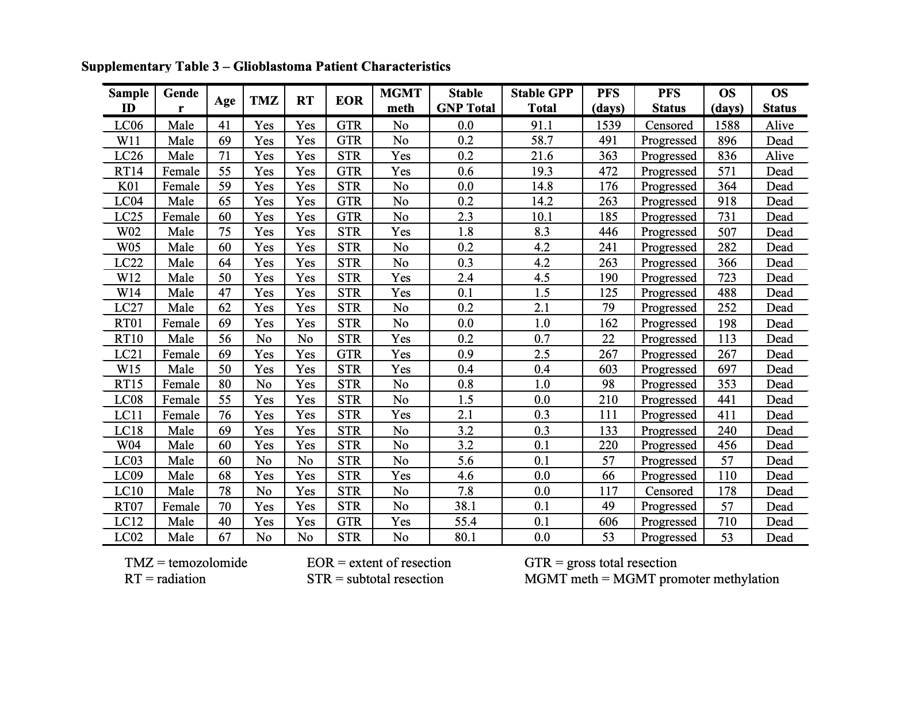

### Unsupervised machine learning reveals risk stratifying glioblastoma tumor cells [[eLife 2020](https://elifesciences.org/articles/56879?_ga=2.152338937.194252844.1613437840-1331803966.1607125053)]

https://github.com/cytolab/RAPID

RAPID identifies single cell phenotypes associated with continuous clinical variables that are stable and validated via complementary approaches.
(**a**) Graphic of tumor processing and data collection. After data collection and standard pre-processing, non-immune, non-endothelial glioblastoma cells were computationally isolated for analysis by RAPID. (**b**) RAPID workflow on glioblastoma cells identified from 28 patients and computationally pooled for t-SNE analysis. Cell subsets were automatically identified by FlowSOM and were systematically assessed for association with patient overall or progression-free survival. 43 glioblastoma cell subsets were identified and were color-coded based on hazard ratio of death and p-values (HR >1, red; HR <1, blue). Cell density, FlowSOM clusters, and cluster significance are depicted on t-SNE plots. (**c**) RAPID results were tested for stability. Each tumor was randomly subsampled for 4,710 cells multiple times. Each of these cell subsampling runs was subject to 100 iterative FlowSOM analyses and an F-measure was calculated for each cluster. Only clusters with an F-measure of greater than 0.5 were considered stable. Then, the phenotypes of stable clusters associated with patient outcome were assessed via RMSD and used to determine stable phenotypes. (**d**) Validation of the findings from the mass cytometry data was done using lower dimensional gating strategies and an orthogonal technology to confirm the biological findings.

### Flow Cytometry in Python

- https://pypi.org/search/?q=Flow+Cytometry
- The fcm flow cytometry analysis library https://pythonhosted.org/fcm/basic.html
- [Cytoflow](https://github.com/cytoflow/cytoflow) (Python tools for quantitative, reproducible flow cytometry analysis) 
    - `pip install cytoflow` or `conda install -c bpteague cytoflow`
