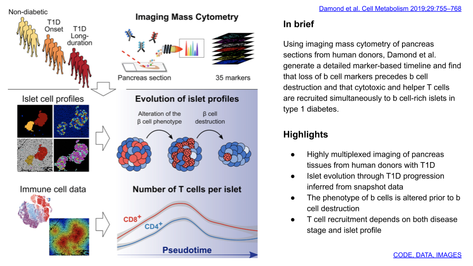
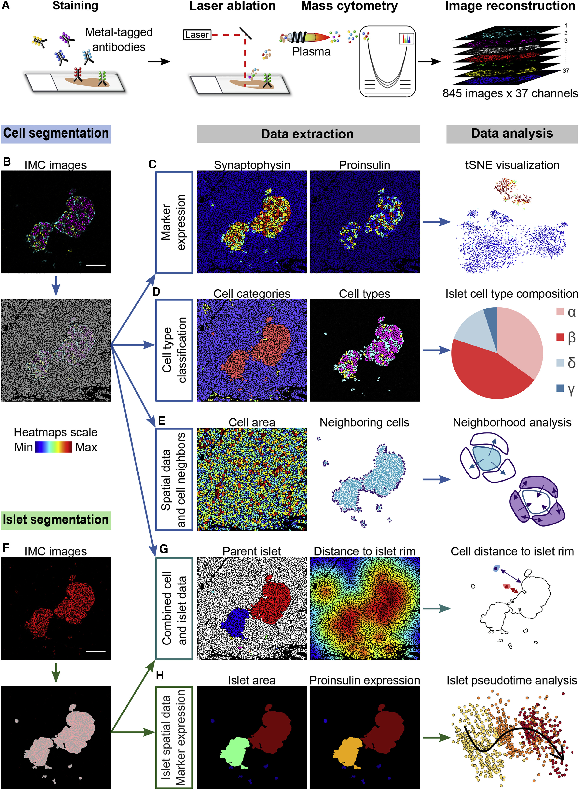
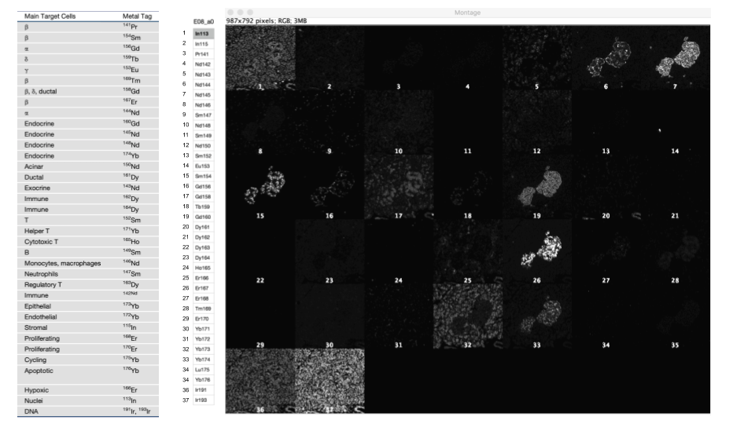
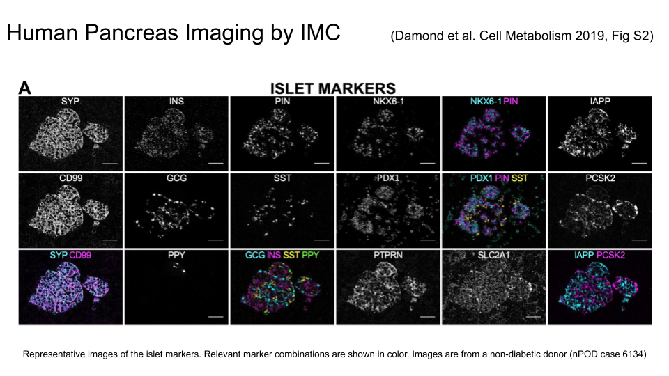
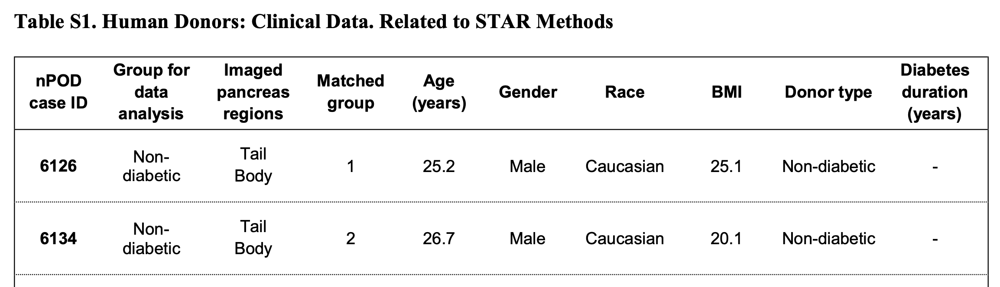
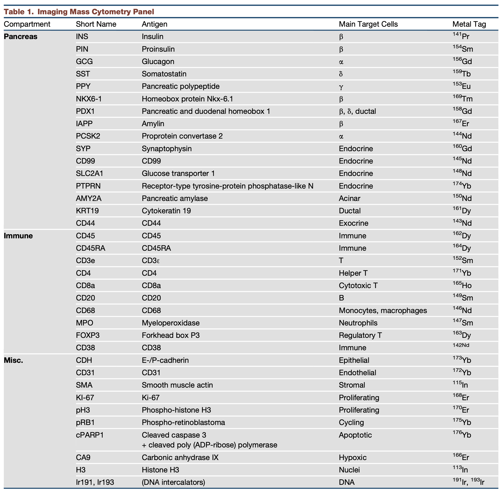

# IMC case from Damond et al. 2019

Damond et al. Cell Metabolism 2019;29:755–768.

### References and links

- Damond  et al. A Map of Human Type 1 Diabetes Progression by Imaging Mass Cytometry. Celll Metabolism 2019;29(3):755-768.e5 [[link](https://www.sciencedirect.com/science/article/pii/S1550413118306910)] [[PDF](../../refs/Damond_etal_A_Map_of_Human_Type_1_Diabetes_Progression_by_Imaging_Mass_Cytometry_Cell_Metabolism_2019.pdf)]
- pancreasMasks: Example CytoImageList object of segmentation masks [[link](https://rdrr.io/bioc/cytomapper/man/pancreasMasks.html)]
- The accession number for the IMC data reported in this paper (including image stacks, single-cell data and islet-level data) is Mendeley Data: https://data.mendeley.com/datasets/cydmwsfztj/2 (version 2, 09-04-2020)

### Acquisition of Single-Cell and Islet-Level Data by IMC

**Damond et al. (2019), Figure 1** 

(**A**) IMC workflow. A laser ablates the tissue spot by spot, generating clouds of particles that are atomized and ionized in an inductively coupled plasma before analysis by mass cytometry. Based on ion cloud composition, an image of the ablated area is created for each measured marker.

(**B**) IMC images, here represented by a combination of proinsulin (magenta), glucagon (cyan), and somatostatin (yellow) (top), were segmented into cells. The cell mask is shown as a white overlay (bottom).

(**C**) Marker expression was measured by applying cell masks onto IMC images (left). Protein abundance in single cells can be visualized using tSNE (right).

(**D**) Imaged cells were classified into cell types (left). Cells were first divided into four categories: islet (red), exocrine (blue), immune (green), and “other” (yellow) (left). Each category was then subdivided into cell types. Islet cells were classified as α (cyan), β (magenta), δ (yellow), or γ (red) cells (center). This allowed determination of islet cellular composition (right).

(**E**) Cell masks enabled retrieval of spatial data, such as cell area (left). Neighborhood information (center) was used to systematically analyze cell-cell interactions (right).

(**F**) The expression of endocrine cell markers, such as synaptophysin (red) (top), was used to identify islets and generate islet masks (white overlay, bottom).

(**G**) By combining cell and islet masks, each cell was related to the islet to which it belongs (left). The distance of cells to the islet rim was also measured (center), allowing comparison of cell positions relative to islets (right).

(**H**) Spatial information (left) and protein abundance (center) were measured at the islet level using islet masks. Islet level data were used to perform pseudotime analyses (right).

_Scale bars: 100 μm_

|image | case | slide | part | group | stage |
|:-----:|:----:|:----:|:----:|:-----:|:------:|
|  E08 |  6126 |  E |   Tail |  1    |   Non-diabetic |

### Extraction of Single-Cell and Islet-Level Data
Cell segmentation is essential to recover quantitative single-cell information from highly multiplexed images ([Carpenter et al., 2006](https://genomebiology.biomedcentral.com/articles/10.1186/gb-2006-7-10-r100)). We used supervised machine learning and computer vision algorithms to generate cell and islet segmentation masks, which represent pixels belonging to the same cell or islet, respectively (Figures 1B and S3; STAR Methods) ([Kamentsky et al., 2011](https://academic.oup.com/bioinformatics/article/27/8/1179/228479); Sommer et al., 2011). Applying these masks over high-dimensional pictures allowed retrieval of phenotypic and functional marker expression, spatial information, and neighborhood information. We also combined cell and islet masks to extract additional information, such as the distance from cells to the islet rim (Figures 1C–1H). Although cell populations can be defined using clustering approaches, we sought a more accurate way to define cell types in our dataset and turned to supervised machine-learning approaches (Figure S3; STAR Methods) ([Sommer et al., 2011](https://ieeexplore.ieee.org/document/5872394)). We first trained a classifier to segregate cells into four main categories (i.e., islet, immune, exocrine, other) and then performed sub-classification within each category in order to identify individual cell types. Together, these approaches enabled extraction of a wide range of biological information that can be explored in downstream data analyses to gain deeper insights into cell phenotypes and tissue function.

## METHOD DETAILS (as in the [original paper](https://www.sciencedirect.com/science/article/pii/S1550413118306910))

### Human Organ Donors
Pancreas samples were obtained from nPOD - Network for Pancreatic Organ Donors with Diabetes "Sharing for cure" (https://www.jdrfnpod.org). All procedures were approved by the University of Florida Institutional Review Board (IRB201600029) and the Zurich Cantonal Ethics Committee (2017-02302).
For each donor, a medical chart review was performed and C-peptide measured (Campbell-Thompson et al., 2012a) with T1D diagnosis determined or confirmed according to the ADA guidelines. Demographics, length of hospitalization, and organ transport duration information was obtained from hospital records or UNOS. Donor pancreata were recovered, shipped in transport media on ice via organ courier to the University of Florida, and processed by a licensed pathology assistant (Campbell-Thompson et al., 2012b). The cases were selected to represent recent onset T1D (<0.5 years), long-standing T1D (R8 years), and non-diabetes control. Four groups of three donors with different disease duration but matched by age and gender were analyzed. Additional donor information is listed in Table S1.

### Antibody Testing and Validation
All antibodies in the panel (**Table 1**) were initially tested by IF on lymphoid tissues (spleen, tonsil, and lymph node) for antibodies targeting immune markers and on pancreas for the other markers. Only antibodies that produced expression patterns consistent with the literature and a high signal intensity were conjugated to metals. After metal labeling, all antibodies were tested again by IMC to ensure that antibody specificity was not affected by conjugation. Finally, the entire antibody panel was used to stain two tissue arrays: an array containing large cores from six different tissues and a microarray containing 78 cores representing 20 different tissues from healthy subjects and cancer patients. In this way, each antibody could be positively validated on tissues known to express the target antigen and negatively validated on tissues known to be negative for that antigen. See also the .cvs file [[table1_IMC_panel_37x4.csv](./data/table1_IMC_panel_37x4.csv)].

### Tissue Staining
Two sections per pancreas, from head, body, or tail, were stained with our full antibody panel (Table 1). Slides were incubated for 1 hr at 60 C in a dry oven, deparaffinized in fresh Xylol, and rehydrated through a graded alcohol series. Antigen retrieval was performed in a decloaking chamber (Medite) for 30 min at 95 C in Tris-EDTA, pH 9.2. After blocking in buffer containing 10% normal horse serum, slides were incubated overnight at 4C with three primary antibodies: rabbit anti-glucagon-156Gd, rabbit anti-synaptophysin-160Gd, and goat anti-Pdx1 (unconjugated). The next day, slides were incubated with anti-rabbit IgG-Alexa Fluor 488 and anti-Goat IgG-158Gd secondary antibodies for 1 hr at room temperature, followed by Hoechst dye counterstaining (5 min at room temperature). Slide scanner imaging was performed at this stage (see Selection of Areas of Interest below). Two successive overnight incubations at 4C were then performed for labeling with the remainder of primary antibodies (13 primary antibodies on the first night and 19 on the second night). Finally, slides were counterstained with iridium intercalator for 5 min at room temperature, quickly dipped in doubly distilled H2O, and immediately dried with pressurized air.

### Selection of Areas of Interest
Pancreas sections stained for glucagon and synaptophysin and counterstained with Hoechst were imaged with a slide scanner (Zeiss Axio Scan.Z1) at 20X magnification. Areas of interest were chosen manually based on islet size (islets representing the complete spectrum of size observed but with an enrichment for large islets) and islet position (to ensure distribution of sampling over the whole section) (Figure S1A). Area size was defined as the axis-aligned minimum bounding box containing all islets in the area, expanded by 100 mm in all directions. The coordinates of areas of interest were recorded using ImageJ and transformed to IMC coordinates using a custom Python script (see Key Resources Table).

### IMC Image Acquisition
Data acquisition was performed on a Helios time-of-flight mass cytometer (CyTOF) coupled to a Hyperion Imaging System (Fluidigm). Prior to laser ablation, optical images of slides were acquired using the Hyperion software, and the areas to ablate were selected as described above. Laser ablation was performed at a resolution of approximately 1 mm and a frequency of 200 Hz. Slides were acquired in a randomized order over 25 consecutive days. To ensure performance stability, the machine was calibrated daily with a tuning slide spiked with five metal elements (Fluidigm). In total, 851 image stacks from 24 pancreas sections were acquired. Three were removed due to data corruption, one due to poor image quality, and two because the areas did not contain any islets. All analyses were performed on the 845 remaining image stacks.

### IMC Data Preprocessing
Text format (.txt) files generated during data acquisition were converted to tiff images using a custom Python script (https://github.com/BodenmillerGroup/imctools). For visualization, false color images were prepared from tiff images using Fiji (https://fiji.sc).

### Spillover Compensation
Although spectral overlap between pure metal isotopes is very limited, channel crosstalk caused by isotopic impurity, oxide formation, and imprecision in ion detection still exist (Chevrier et al., 2018). To measure crosstalk from one channel to the other, we generated a slide spotted with the same metals used for antibody conjugation (one metal isotope per spot). With this strategy, each metal can be measured individually while having all channels open for detection, thus allowing for spillover quantification across all measured channels. The slide was measured three times during the 25 days of IMC data acquisition, and an average spillover matrix was generated from the resulting data (Figure S1B). This matrix was used to correct for spillover in our dataset (Figure S1C), as described (Chevrier et al., 2018).

### Image Segmentation
We generated cell segmentation masks in two steps: First, we used the interactive machine learning software ilastik to classify pixels as nucleus, cytoplasm/membrane, and background compartments. Second, we imported the probability maps generated by ilastik into CellProfiler to identify individual nuclei, define cell borders, and generate cell masks. We adopted a similar approach to segment islets (Figure S3).

### Pixel Classification
For cell segmentation, the pixels in each image were defined as belonging to the nucleus, cytoplasm, or background compartment using the pixel classification module of the open source software ilastik (Sommer et al., 2011) as described (Schulz et al., 2018) (https://github.com/BodenmillerGroup/ImcSegmentationPipeline). Training of the Random Forest classifier was performed on 125 3 125 pixels substacks generated from the original images and containing only informative markers (i.e., H3, CDH, CD99, CD44, MPO, SYP, KRT19, CD45, CD31, SMA, and Iridium). This allowed for the generation of maps that integrate for each pixel the probability of belonging to each of three compartments, as shown in Figure 1B (center). Based on the trained classifier, probability maps were generated for the whole dataset and exported as tiff files in batch mode.

### Cell Segmentation
CellProfiler (Kamentsky et al., 2011) was subsequently used to define cell masks and quantify marker expression. To define cell borders, nuclei were first identified as primary objects based on `ilastik` probability maps and expanded through the cytoplasm compartment until either a neighboring cell or the background compartment was reached. Cell masks were generated for identification of single cells and used to extract single-cell information (marker abundance, spatial and neighborhood data) from the original images. The results were exported as csv tables for further analysis.

### Islet and Blood Vessel Segmentation
Islet and blood vessel segmentation was performed in a similar manner as cell segmentation with the following modifications: i) for `ilastik` pixel classification, images were divided into islet, blood vessels, and ‘‘other’’ (that is non-islet, non-vessel) compartments based on substacks containing informative markers (i.e., SYP, CD99, CD31, CD45, AMY2A, KRT19, and Iridium); ii) in CellProfiler, islets and blood vessels were directly defined as primary objects. Distance to islet rim was measured by combining islet and cell masks, using a custom CellProfiler plugin (https://github.com/BodenmillerGroup/ImcPluginsCP).

### Cell Type Definition
The object classification module of `ilastik` was used to define cell types (Figure S3). First, binary cell masks and substacks containing relevant markers (i.e., CD99, SYP, AMY2A, KRT19, CD44, CDH, CD45, CD3, CD8, CD20, MPO, CD68, and SMA) were loaded into `ilastik` and a classifier was trained in order to divide the cells in four main categories (islet, immune, exocrine, and ‘‘other’’). The resulting object predictions were exported as tiff images and imported into CellProfiler to generate cell masks specific to each cell category. The process was iterated to subdivide each category into cell types. For islet cell type definition, masks containing only cells defined in the first step as belonging to the islet category were imported into `ilastik`, and a new training was performed to attribute a, b, d, and g cell types based on the expression of islet-expressed markers (i.e., INS, PIN, GCG, SST, PPY, PDX1, NKX6-1, IAPP, PCSK2, CD99, and SYP). The same approach was adopted to define B cells, cytotoxic and helper T cells, monocytes/macrophages, and neutrophils among immune cells (markers used: CD45, CD3e, CD4, CD8a, CD20, CD68, MPO, and CD45RA). In addition, exocrine cells were divided into acinar and ductal cells (markers used: KRT19, AMY2A, CD44, and CDH), and ‘‘other’’ cells were divided into three cell types: endothelial (also includes peri-endothelial cells), stromal, and unknown (markers used: SMA, CD31, CD68, and CDH).

### Pseudotime Analysis
Pseudotime analysis was performed using the trajectory inference algorithm SCORPIUS (Cannoodt et al., 2016), and results were confirmed using the Monocle2 DDRTree algorithm (Qiu et al., 2017). Only islets containing 15 cells or more were considered. Islet expression profiles and pseudotime ordering were based on the expression of islet-expressed markers averaged over the islet sectional area. All measured islet markers were considered (INS, PIN, GCG, SST, PDX1, NKX6-1, IAPP, PCSK2, SLC2A1, PTPRN, SYP, and CD99), except for PPY. The presence of a g cell-rich pancreas head section in one donor with long-duration T1D tended to confound the algorithms, resulting in classification of the very few g cell-rich islets from non-diabetic donors into the long-duration (pseudostage 3) category. Raw IMC counts averaged over islet areas were used as an input.

### Neighborhood Analysis
Neighborhood analysis was performed using R and histoCAT (Schapiro et al., 2017). Custom scripts were used to import cell type and pseudotime information into histoCAT (see Key Resources Table). An expansion of 3 pixels was used to detect cell neighbors. The presence of significant cell type association or avoidance was determined using 999 random permutations of cell type labels and a significance threshold of p < 0.01. All other parameters and methods were chosen as suggested in the original publication (Schapiro et al., 2017).

### Data Analysis
Data were analyzed and graphed using R and histoCAT (Schapiro et al., 2017). In particular, an R implementation of tSNE (https:// cran.r-project.org/web/packages/tsne) was used to generate tSNE maps (van der Maaten and Hinton, 2008). Unless otherwise stated, raw IMC counts were 99th-percentile-normalized and scaled from 0 to 1 (scaled counts).

### Statistics
Statistical tests were performed using R. Statistical parameters are reported in the figure legends. For pairwise group comparisons, we systematically used a non-parametric statistical test (unpaired, two-tailed Mann-Whitney U test) and applied the Holm post hoc adjustment method to correct for multiple comparisons. Overall, the p value significance threshold was defined as 0.01. In text and figures, N represents the number of donors and n represents either the number of cells or the number of islets (as indicated in figure legends). In histograms, bars represent the means and error bars represent standard errors of the mean. Correlation analyses in Fig- ure 4H were performed using Pearson’s r correlation coefficient. As mentioned above (see the IMC Image Acquisition paragraph), six out of 851 IMC images were excluded because of data corruption, poor image quality, or absence of islets. No other data or values were excluded from our analyses.

### DATA AND SOFTWARE ABILITY
The accession number for the IMC data reported in this paper (including image stacks, single-cell data and islet-level data) is Men- deley Data: https://doi.org/10.17632/cydmwsfztj.2. Custom code generated by the Bodenmiller lab for IMC data preprocessing and image segmentation is available online (https://github.com/BodenmillerGroup); histoCAT can be downloaded as a standalone appli- cation from the project page (https://github.com/BodenmillerGroup/histoCAT). Scripts for IF-to-IMC coordinate transformation, as well as code related to neighborhood analysis (cell type and pseudotime import and custom clustering) are available from Mendeley data (https://doi.org/10.17632/cydmwsfztj.2).

### Software and Algorithms

| Tool   |      Reference      |  URL |
|----------|:-------------:|:------|
| CellProfiler 2.2.0	|Kamentsky et al., 2011	| http://cellprofiler.org |
| Fiji (ImageJ 1.51u)|	Schindelin et al., 2012	| https://fiji.sc |
| histoCAT 1.73 |	Schapiro et al., 2017	| https://github.comBodenmillerGroup/histoCAT/releases |
| Ilastik 1.2.2	|Sommer et al., 2011	| http://www.ilastik.org |
| Python 3.4.3	| Python Software Foundation	| https://www.python.org |
| R 3.4.1	| R Development Core Team	| https://www.r-project.org |
| Tools for IMC data processing|	Bodenmiller lab |	https://github.comBodenmillerGroup/imctools |
| IMC data segmentation pipeline	| Bodenmiller lab	| https://github.com/BodenmillerGroup/ImcSegmentationPipeline |
| Custom CellProfiler plugins|	Bodenmiller lab	| https://github.com/BodenmillerGroup/ImcPluginsCP |
| Code and guidelines for spillover compensation	| Bodenmiller lab	| https://github.com/BodenmillerGroup/cyTOFcompensation|
| IF-to-IMC coordinate transformation |	This paper |	https://doi.org/10.17632/cydmwsfztj.2 |
| Code related to neighborhood analysis |	This paper |	https://doi.org/10.17632/cydmwsfztj.2 |
| SCORPIUS 1.0	| Cannoodt et al., 2016	| https://github.com/rcannood/SCORPIUS |
| Monocle2	| Qiu et al., 2017	| http://cole-trapnell-lab.github.io/monocle-release/docs |
| R implementation of tSNE |	Justin Donaldson |	https://cran.r-project.org/web/packages/tsne |

## Description
https://data.mendeley.com/datasets/cydmwsfztj/2

Data related to the publication: "A Map of Human Type 1 Diabetes Progression by Imaging Mass Cytometry".

Damond N, Engler S, Zanotelli VRT, Schapiro D, Wasserfall CH, Kusmartseva I, Nick HS, Thorel F, Herrera PL, Atkinson MA and Bodenmiller B. Cell Metab. 2019 Mar 5;29(3):755-768.e5.
https://doi.org/10.1016/j.cmet.2018.11.014

We used imaging mass cytometry to simultaneously image 37 biomarkers with single-cell and spatial resolution in pancreas sections from 12 human donors at different stages of type 1 diabetes.

**CODE:**
- Python script for coordinate transformation
- Functions for custom histoCAT neighborhood analysis

**DATA:**
- Single-cell data
- Islet-level data
- Cell type information
- Cell relationships (cell-cell neighborhoods and cell-islet relationships)
- Donors and image metadata.
- Subset containing the data for 100 images from 3 donors

**IMAGES:**
- Image stacks (37 channels) for all donors (one .7z file per donor, numbers indicate nPOD case IDs)
- Cell masks
- Panel file with information related to antibodies and metal tags
- Metadata file linking donor information to images
- Metadata file linking image stack slices and panel information
- Subset containing 100 images from 3 donors

_Download all: 7829 MB_  [[link](https://md-datasets-cache-zipfiles-prod.s3.eu-west-1.amazonaws.com/cydmwsfztj-2.zip)]

**Under the CC BY 4.0 license**:
The files associated with this dataset are licensed under a  Creative Commons Attribution 4.0 International  license, i.e. you can share, copy and modify this dataset so long as you give appropriate credit, provide a link to the CC BY license, and indicate if changes were made, but you may not do so in a way that suggests the rights holder has endorsed you or your use of the dataset. Note that further permission may be required for any content within the dataset that is identified as belonging to a third party.
